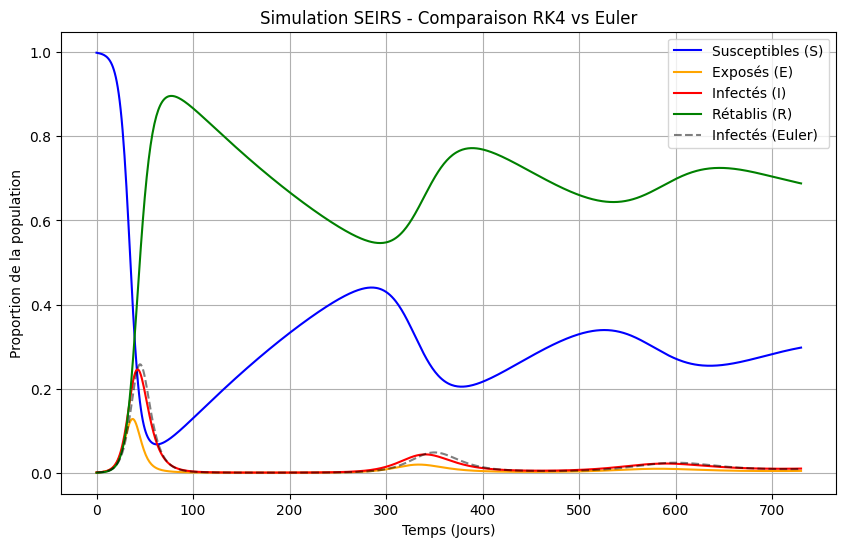
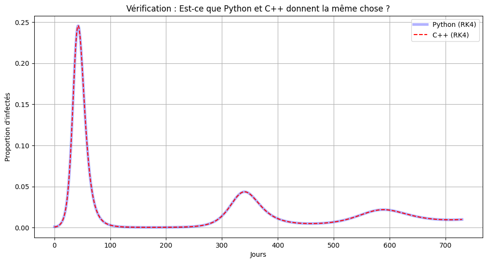
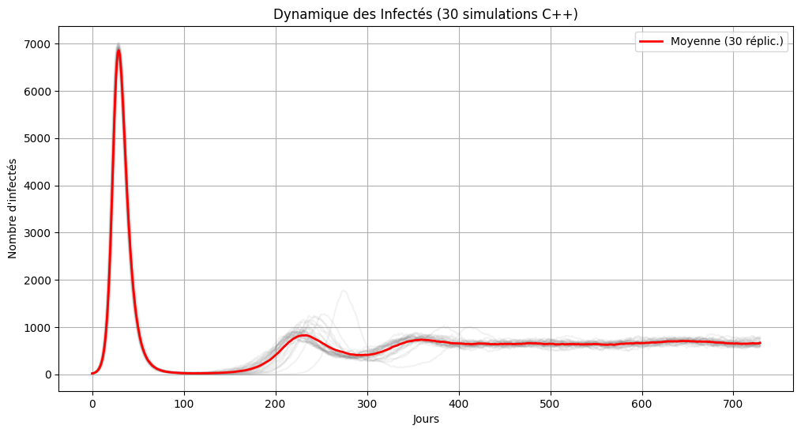
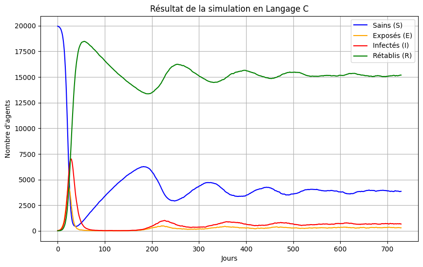

# Simulation épidémiologique SEIRS en Python, C++ et C

**Étudiante :** Salma BENSMAIL (Master 2 CHPS)  
**Année :** 2025-2026

## Description

Ce projet étudie la dynamique d'une épidémie via deux approches complémentaires :

1. **Partie 1 (ODE)** : résolution numérique d'équations différentielles (Euler, RK4).
2. **Partie 2 (SMA)** : simulation multi-agents optimisée (Python, C++, C).

L'objectif est d'analyser l'impact du choix technologique sur la performance HPC et l'empreinte énergétique (Green Computing).

## Structure du dépôt

```text
Projet_Synthese_SEIRS_Bensmail/
├── README.md
├── figures/
│   ├── comparaison_rk4_euler.png
│   ├── validation_python_cpp.png
│   ├── sma_dynamique_infectes.png
│   └── simulation_langage_c.png
├── notebooks/
│   ├── Salma_BENSMAIL_Projet_Partie1_ODE.ipynb
│   ├── Salma_BENSMAIL_Projet_Partie2_SMA.ipynb
│   └── Salma_BENSMAIL_Projet_Partie3_Bonus.ipynb
└── reports/
    └── Salma_BENSMAIL_Rapport_Projet_SEIRS.pdf
```

## Contenu du dépôt

- [Rapport scientifique complet](reports/Salma_BENSMAIL_Rapport_Projet_SEIRS.pdf) : analyse, résultats et preuves.
- [Notebook Partie 1 - ODE](notebooks/Salma_BENSMAIL_Projet_Partie1_ODE.ipynb) : résolution numérique et comparaison Python vs C++.
- [Notebook Partie 2 - SMA](notebooks/Salma_BENSMAIL_Projet_Partie2_SMA.ipynb) : simulation multi-agents et comparaison Python / C++ / C optimisé.
- [Notebook Partie 3 - Bonus](notebooks/Salma_BENSMAIL_Projet_Partie3_Bonus.ipynb) : optimisations avancées, générateurs aléatoires et mesures énergétiques.

## Instructions d'exécution

**Note importante :** ce projet utilise une approche de type *Notebook Orchestrateur*. Les codes sources C et C++ sont intégrés directement dans certaines cellules des notebooks via la commande `%%writefile`.

Pour reproduire les résultats :

1. Ouvrir un notebook, par exemple [Partie 2 - SMA](notebooks/Salma_BENSMAIL_Projet_Partie2_SMA.ipynb).
2. Exécuter les cellules séquentiellement (**Run All**).
3. Le notebook va automatiquement :
   - générer les fichiers `.c` et `.cpp`,
   - les compiler avec `gcc` / `g++`,
   - lancer les exécutables,
   - récupérer les résultats et tracer les courbes.

## Résultats clés

- **Performance :** le code C optimisé réduit le temps d'exécution d'un facteur 91 par rapport à la version Python.
- **Green Computing :** la consommation énergétique a été divisée par un facteur 270.

## Visualisation des résultats

### 1. Approche déterministe (ODE)

#### Comparaison des schémas numériques



#### Validation cross-language



### 2. Approche stochastique (SMA)

#### Dynamique des infectés



#### Simulation globale en langage C


